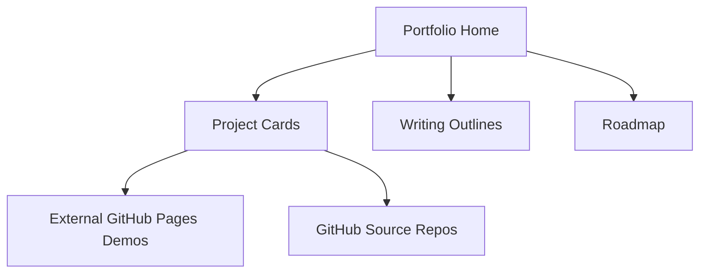

# Abhi Khurana Portfolio

Main personal portfolio site for showcasing software engineering projects, writing tracks, and technical roadmap items.

## Live Site

- URL: `https://abhikhur27.github.io/`

## Project Goals

- Present projects with a cohesive design language and clear technical depth.
- Organize work by category (systems, visualization, tools, interactive apps).
- Provide writing section scaffolds with concrete research/source plans.
- Keep everything fully static and GitHub Pages compatible.
- Include embedded previews and portfolio-breadth subprojects:
  - `projects/transit-network-lab`
  - `projects/sports-analytics-explorer`

## Technical Design

- `index.html`: semantic page structure with sections for hero, projects, writing, and roadmap.
- `styles.css`: shared visual system (tokens, spacing, typography, responsive layout, animation states).
- `script.js`: client-side filtering, mobile nav behavior, reveal-on-scroll, and timestamp rendering.

### Architecture



## Accessibility and UX

- Keyboard-accessible nav and project filters.
- `Skip to content` link for screen readers and keyboard users.
- Reduced motion support via `prefers-reduced-motion`.
- Responsive behavior for mobile nav and card grids.

## Local Usage

Serve statically from the repo root:

```bash
python -m http.server 8000
```

Then open `http://localhost:8000`.

## Deployment (GitHub Pages)

This repository is the username site (`abhikhur27.github.io`), so publishing from the default branch root serves at:

- `https://abhikhur27.github.io/`

## Future Improvements

- Add CI for broken-link checking and HTML validation.
- Add Lighthouse performance budget checks.
- Pull project metadata from a JSON manifest to avoid duplicated links.
