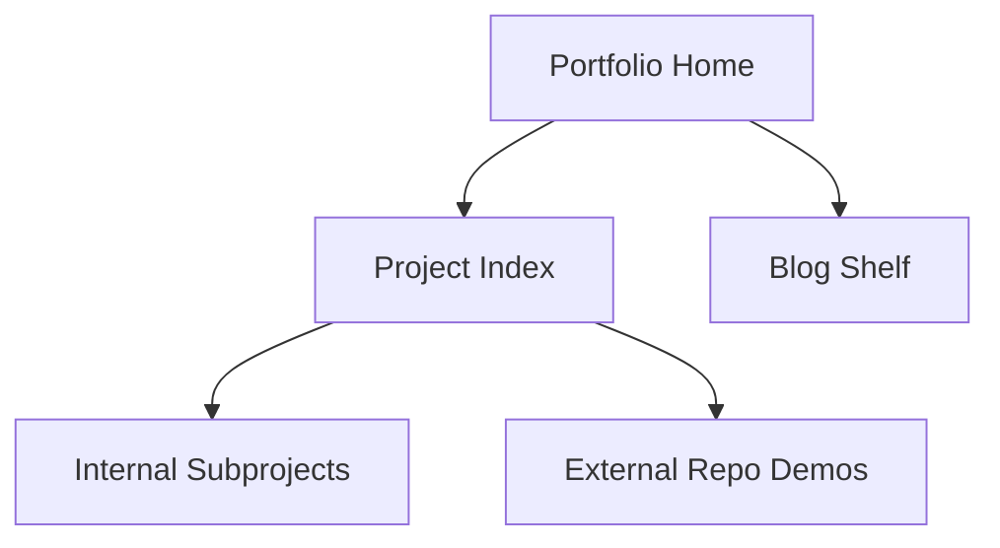

# Abhi Khurana Portfolio

Main personal site for project demos and an in-progress engineering blog.

## Live Site

- URL: `https://abhikhur27.github.io/`

## Focus of this version

- Dark "digital spaces" visual language.
- Project directory with category filtering.
- Blog-style expandable writing shelf for draft essays.
- Writing queue board that keeps the next three closest-to-shipping drafts visible.
- Shipping board that ranks visible drafts by how close they are to becoming full posts.
- Draft shelf summary cards for visible stages and topic mix.
- Topic atlas cards that turn the draft shelf into lane-based navigation.
- A linked-trails layer that bridges projects with the drafts already growing out of them.
- A real-life builds shelf for physical projects (3D prints, woodworking, robotics, homelab logs).
- Fully static architecture for GitHub Pages.
- Stage-aware draft shelf filters for planning the blog pipeline.
- Shareable project and draft-shelf view links so filtered homepage states can be sent directly.

## Included subprojects in this repo

- `projects/transit-network-lab`
- `projects/sports-analytics-explorer`
- `projects/rail-headway-sandbox`
- `projects/market-regime-lab`
- `projects/queueing-resilience-lab`
- `projects/cache-policy-studio`
- `projects/latency-budget-planner`
- `projects/incident-command-lab`
- `projects/patch-window-commander`
- `projects/detour-dispatch`
- `projects/registration-rush-command`
- `projects/office-hours-overflow`
- `projects/systems-decision-labs`
- `projects/sound-shift-studio`
- `projects/merge-conflict-studio`
- `projects/sprint-cutline`
- `projects/schema-drift-command`
- `projects/failure-mode-atlas`
- `projects/control-loop-lab`
- `projects/handoff-briefing-lab`

## Technical design

- `index.html`: semantic structure for hero, project index, real-life builds shelf, blog sections, and topic filters.
- `projects/systems-decision-labs`: anthology page that groups the repeated campus/infrastructure decision sims into one portfolio family.
- `projects/cache-policy-studio`: cache policy sandbox for TTL, stale windows, and origin-load tradeoffs.
- `projects/latency-budget-planner`: latency budgeting surface for turning network/backend/render slices into loader and optimistic-UI guidance.
- `projects/sound-shift-studio`: branching sound-change sandbox for exploring language drift.
- `projects/merge-conflict-studio`: three-way merge training game for practicing conflict resolution under behavioral constraints.
- `projects/sprint-cutline`: release-week prioritization game about cutting scope without breaking trust.
- `projects/schema-drift-command`: schema migration decision game about compatibility shims, partner trust, and contract cutovers.
- `projects/failure-mode-atlas`: incident clue-to-failure mapping tool that ranks likely failure families and next diagnostic actions.
- `projects/control-loop-lab`: feedback-stability simulator for lag, gain, damping, and queue spill tradeoffs.
- `projects/handoff-briefing-lab`: incident handoff simulator where the player chooses the five updates that the next shift actually needs.
- `styles.css`: shared ink-style design system.
- `script.js`: project filters, result-count feedback, linked build/draft trails, topic-atlas navigation, writing shelf spotlight controls, shipping board scoring, shareable filtered-view links, stage filters, and mobile nav behavior.
- `docs/portfolio-originality-rubric.md`: the bar future projects must clear before they get built.



## Accessibility and UX

- Keyboard-accessible nav and filter controls.
- `Skip to content` support.
- Reduced-motion handling.
- Responsive layout for mobile and desktop.

## Local usage

```bash
python -m http.server 8000
```

Then open `http://localhost:8000`.

## Future improvements

- Add CI for link checks and HTML validation.
- Add richer blog post pages per topic once the draft shelf narrows them into finished essays.
- Move project metadata into a single manifest.
