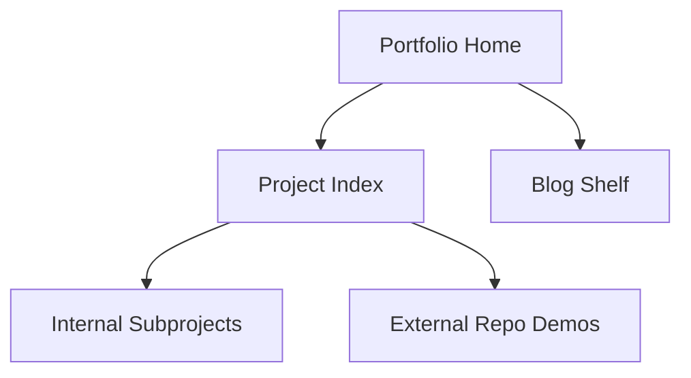

# Abhi Khurana Portfolio

Main personal site for project demos and an in-progress engineering blog.

## Live Site

- URL: `https://abhikhur27.github.io/`

## Focus of this version

- Dark "digital spaces" visual language.
- Project directory with category filtering.
- Blog-style expandable writing shelf for draft essays.
- Draft shelf summary cards for visible stages and topic mix.
- A writing queue that turns the visible shelf into concrete next actions.
- Quick route cards that tune both the project index and draft shelf from one click.
- Fully static architecture for GitHub Pages.
- Stage-aware draft shelf filters for planning the blog pipeline.
- Shareable project and draft-shelf view links so filtered homepage states can be sent directly.

## Included subprojects in this repo

- `projects/transit-network-lab`
- `projects/sports-analytics-explorer`
- `projects/rail-headway-sandbox`
- `projects/market-regime-lab`
- `projects/queueing-resilience-lab`
- `projects/incident-command-lab`
- `projects/patch-window-commander`
- `projects/detour-dispatch`
- `projects/registration-rush-command`
- `projects/office-hours-overflow`
- `projects/systems-decision-labs`
- `projects/sound-shift-studio`
- `projects/merge-conflict-studio`

## Technical design

- `index.html`: semantic structure for hero, projects, blog sections, and topic filters.
- `projects/systems-decision-labs`: anthology page that groups the repeated campus/infrastructure decision sims into one portfolio family.
- `projects/sound-shift-studio`: branching sound-change sandbox for exploring language drift.
- `projects/merge-conflict-studio`: three-way merge training game for practicing conflict resolution under behavioral constraints.
- `styles.css`: shared ink-style design system.
- `script.js`: project filters, result-count feedback, writing shelf spotlight controls, shareable filtered-view links, stage filters, writing queue logic, and mobile nav behavior.
- `docs/portfolio-originality-rubric.md`: the bar future projects must clear before they get built.



## Accessibility and UX

- Keyboard-accessible nav and filter controls.
- `Skip to content` support.
- Reduced-motion handling.
- Responsive layout for mobile and desktop.

## Local usage

```bash
python -m http.server 8000
```

Then open `http://localhost:8000`.

## Future improvements

- Add CI for link checks and HTML validation.
- Add richer blog post pages per topic once the draft shelf narrows them into finished essays.
- Move project metadata into a single manifest.
