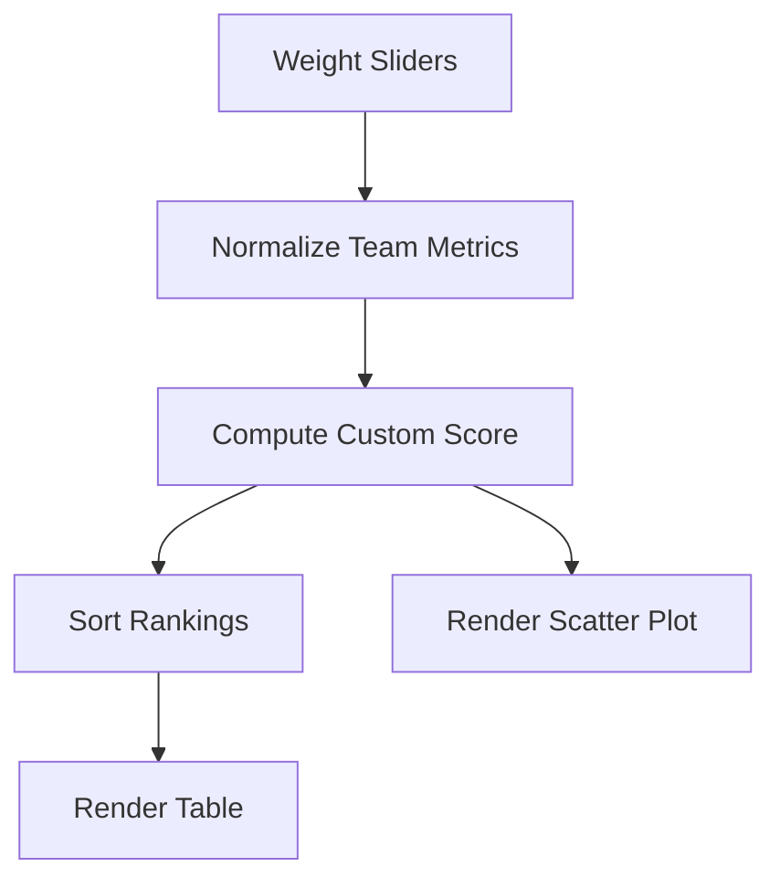

# NBA Offensive Identity Model (2024-25)

Interactive basketball offense modeling dashboard with adjustable factor weights.

## Features

- Custom scoring model based on:
  - Effective FG%
  - Turnover penalty
  - Offensive rebound weight
  - Free throw rate weight
- Real-time ranking table updates.
- Scatter plot (pace vs offensive rating) with score-scaled bubbles.
- Hover inspection on plotted teams.

## Technical Design

- `index.html`: control panel + chart + ranking table.
- `styles.css`: responsive dashboard layout and table styling.
- `script.js`: scoring engine, normalization, canvas chart rendering.



## Local Run

```bash
python -m http.server 8000
```

Open `projects/sports-analytics-explorer/index.html`.

## Future Improvements

- Player-level shot profile decomposition.
- Possession-level simulation for lineup combinations.
- CSV import for custom datasets.
