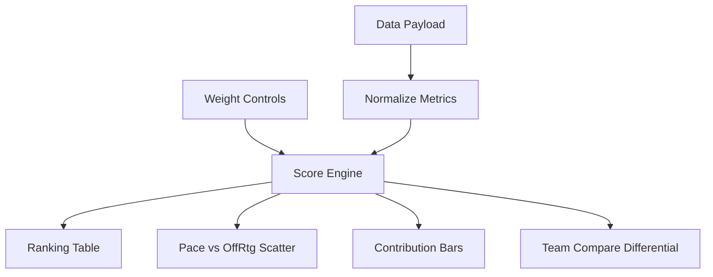

# NBA Offensive Identity Model (2024-25)

Interactive offense profiling dashboard built on real 2024-25 team data.

## Features

- Weight-adjusted offensive model using:
  - Effective FG%
  - Turnover%
  - Offensive Rebound%
  - Free Throw Attempt Rate (FTA/FGA)
- Preset scoring modes (`Balanced`, `Shot Making`, `Physicality`).
- Optional z-score normalization mode for scale-robust comparisons.
- Team-vs-team differential breakdown panel.
- Scatter plot (pace vs offensive rating) with hover inspection.
- Factor contribution bars for the currently top-ranked team.
- CSV export for model rankings.

## Data Source and Validation

- Season: **2024-25 regular season**.
- Source: **StatMuse NBA team query endpoints**.
- Data retrieval script generated `data-2024-25.js` from paired `best`/`worst` queries per metric to capture all 30 teams.

## Technical Design

- `index.html`: controls, compare module, contribution view, and rankings.
- `data-2024-25.js`: sourced dataset payload + metadata.
- `styles.css`: responsive ink-themed interface aligned with portfolio style.
- `script.js`: scoring engine, normalization modes, canvas visualization, export tooling.



## Local Run

```bash
python -m http.server 8000
```

Open `http://localhost:8000/projects/sports-analytics-explorer/`.

## GitHub Pages Compatibility

- Static-only (`HTML/CSS/JS`) implementation.
- No API call is required at runtime.
- Uses relative paths suitable for GitHub Pages.

## Future Improvements

- Add lineup-level decomposition (starter vs bench offensive identity).
- Add confidence intervals via bootstrap resampling.
- Add monthly splits and opponent-adjusted normalization.
