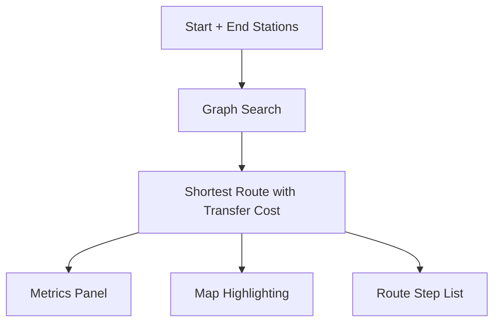

# Transit Network Lab

Interactive urban rail routing simulator using shortest-path computation with transfer penalties.

## Features

- Choose start and destination stations.
- Compute fastest route using Dijkstra-based search.
- Includes transfer penalty modeling.
- Visual route highlighting on network map.
- Route metrics:
  - Total travel minutes
  - Stops traversed
  - Number of transfers

## Technical Design

- `index.html`: controls, metrics, and map containers.
- `styles.css`: responsive layout and route-highlight styling.
- `script.js`: graph modeling, weighted routing, and SVG rendering.



## Local Run

```bash
python -m http.server 8000
```

Open `projects/transit-network-lab/index.html`.

## Future Improvements

- Time-of-day schedules and headway modeling.
- Accessibility weighting (stairs/escalator penalties).
- Delay simulation and rerouting under disruptions.